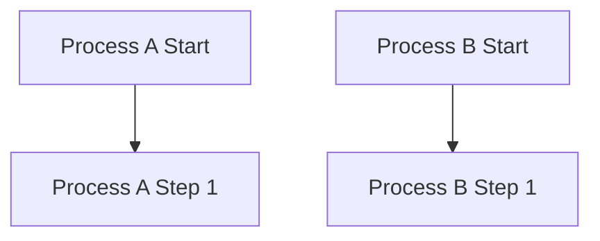

# 1.
### a)
UTP
STP
FTP

-- --
### b)
un cable cross-over 

-- --
### c)
Manchester peut etre transmit plus loin que RTZ, puisque on mesure un bit en fonction de si sont front est montant ou déscendant, et non si il dépasse un threshold particulié.

-- --
### d)
Fibre optique multimode 

-- --
### e)
idk

-- --
-- --

# 2.
### a)

-- --
### b)
100mpbs
idk

-- --
### c)
Une ligne/bus, puisque une connection devra etre coupé pour ne pas faire de boucles infini.

-- --
### d)
idk

-- --
### e)
avec $G(x)=x^3+1$, on peut déterminer que le polynome générateur est $=1x^3+0x^2+0x^1+1$, soit *1001*.
On décale par après le message par un nombre de 0 égale au plus grand degrée de $G(x)$. Dans notre cas, on décale par la gauche de 3 bits.

L'entree: $11010100$
Devient alors: $11010100000$

11010100000
1001
-- -- 
01000100000
-> 
1000100000
1001
-- --
0001100000
->
1100000
1001
-- --
0101000
->
101000
1001
-- --
001100
->
1100
1001
-- --
0101
---> Donc, puisque 101 < 1001, le CRC est de *101*
       et la reponse final sera de :
       11010100*101*

-- --
-- --

# 3.
### a) 
1: *Routage*
	C'est la manière de trouver la route entre deux point via la retrouvaille de chemin peut a peu avec l'aide des addresses MAC et IP (les identifiants des objets)
2: *Adressage*
	C'est la facon dont on détermine l'addresse d'un objet ou service. Par exemple, on peut donner à un ordinateur une addresse IP particulière, qui pourra ensuite être trouvé, si l'on le souhaite, par routage.

### b)
*Physique & logique*
	L'adressage physique est une adresse donné à uniquement une instance d'une pièce électronique (MAC), tandis que logique est assigné via commandes et peut être modifier (IP)
*Absolu & hiérarchique*
	Absolu veux simplement dire qu'un adresse donnée n'est pas nécessairement lié à une autre, même si elles sont tout les deux sur le même réseau (IPv6). Hiérarchique implique une descendance des adresses par rapport à leurs endroits/fonctions (IPv4)
*Statique & dynamique*
	Une adresse statique restera toujours la même, peu importe les circonstances. Une adresse attribué dynamiquement peut être différent d'une requête de renouvelement à l'autre (DHCP).
*Privé & publique*
	Une adresse IP privé est une adresse qui n'a le droit d'être accèdé que par le réseau local qui l'entoure (IPv4). Les adresses publiques, elles, peuvent être trouvé via routage sur internet (IPv4 et IPv6)

-- --
### c)

-- -- 
### d)
Le routage hiérarchique permet de savoir déjà par quel préfixe commence plusieurs addresses dans un réseau donnée. Cela fait en sorte que les routeurs on, pour la même information, besoin de moins d'espace de stockage et d'envoie/réception, ce qui rend les protocoles plus efficace.

-- --
### e)
arrange toi buddy

-- --
### f)
Non, chaque calculs de Dijsktra sont effectué individuellement par chaque routeurs.

-- --
### g)
idk

-- --
### h)
idk

-- --
### i)
idk

-- --

### j)
P1R1 se trouve au bordure d'a la foit Area 0.0.0.0 et 1.0.0.0. Il peut etre considéré au deux endoits en meme temps.
e0/0 = 10.1.1.*1*/24
s0/0 = 192.168.1.*1*/30
s0/1 = 192.168.1.*5*/30

-- --
-- --

# 4.
### a)

### b)
idk

-- --

### c)
*158.112.245.3/19*
	158.112.xxx.0 -> il reste 3 bits a assigner au reseau. 128+64+32 = 224 < 245. Donc, 
	l'adresse réseau est de 158.112.224.0
*1FA3:2F5:C14:B3:58::1/58*
	1FA3:2F5:C14:B3:58::1 -> cest du naisage 
-- --
### d)
DHCP.
jsp
peut etre

-- --
### e)
IMCP
message derreur
jsp
peut etre

-- --
-- --

# 5.
### a)
idk

-- --
### b)
UDP envoie des messages sans connection, à une adresse, sans vérification sauf pour un simple checksum du header.
TCP envoie des messages avec un Three-Way Handshake, avec bien des vérification de connection et de données. Il est favorisé lorsque la qualité vaut plus que la quantité.

-- --
### c)

-- --
### d)
Toute le paquet (header et données)

-- --
### e)
idk

-- --
-- --

# 6.
### a)
idk

-- --
### b)
Surement TCP?
Par flux?

-- --
### c)
IMAP pour du texte, POP3 pour des pieces jointes

-- --
### d)
idk

-- --
### e)
Trivial File Transfer Protocol
TCP
Plus léger que FTP, donc systèmes embarqué?

-- --
