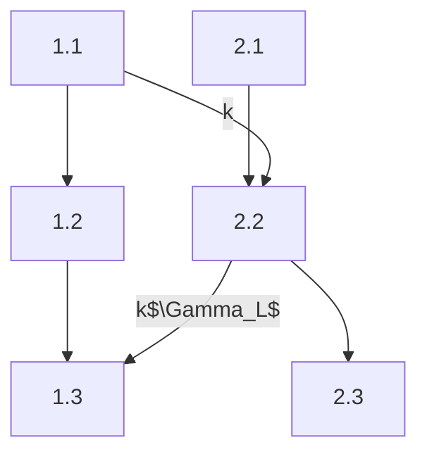

Effet de peau: Tendance a un signal de se transmettre sur la surface du cable

$$\hat{Z}_C = \dfrac{\hat{z}}{\hat{y}}$$, ou $\hat{z} = r+j\omega l$ et $\hat{y} = g+j\omega c$

$$\gamma =  \alpha+j\beta = \sqrt{\hat{z}\cdot\hat{y}}$$

Phaseurs:
$$\hat{v}^{\pm}=A\cdot e^{\pm j \beta z}$$
Pour les pertes:
$$\hat{v}^{\pm}=A\cdot e^{\pm j \beta z}\cdot e^{-\gamma z}$$

Enveloppe de signal:

$$TOS=(V?)\cdot\dfrac{1+|\hat{\Gamma}_L|}{1-|\hat{\Gamma}_L|}=\dfrac{|V|^++|V|^-}{|V|^+-|V|^-}=\dfrac{|\hat{V}|_{Max}}{|\hat{V}|_{Min}}$$

